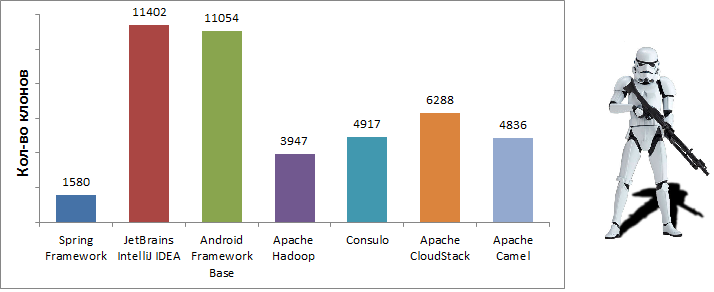
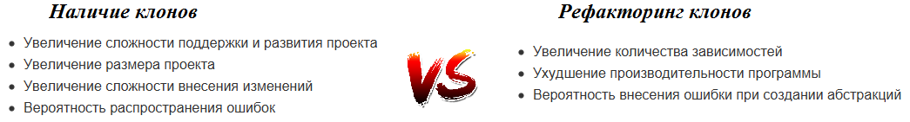

В данной статье мне бы хотелось рассказать о программных клонах. По сути, программные клоны - это просто схожие фрагменты исходного кода. Не смотря на то, что проблемы, связанные с ними довольно часто упоминаются в различных обсуждениях и публикациях, актуальность этих проблем из года в год остается неизменной.



В рамках данной статьи, мне бы хотелось напомнить что же такое программные клоны, откуда они берутся, какие влекут за собой проблемы и как с ними можно бороться. В статье приводятся примеры рефакторинга реальных клонов из популярного фреймворка Spring. В качестве инструментов используются **Java 8**,  IDE **IntelliJ IDEA** 2017.1 и плагин **Duplicate Detector** 1.1.

### Откуда берутся клоны?

Копирование кода является общеизвестно плохой практикой, однако именно при копировании появляется подавляющее большинство клонов. Разумеется, это не единственная причина, существуют и другие, более объективные. Например, сам язык программирования может быть недостаточно выразительным или у разработчика может не хватать прав для редактирования исходного кода.

В целом, можно выделить следующие основные причины возникновения клонов:

- Умышленное копирование фрагментов программы
- Многократное использование сложного API
- Повторная реализация существующей функциональности
- Слабая выразительность используемого языка
- Недостаток прав для модификации исходного кода

### Нужно ли бороться с клонами?

С одной стороны, дублированный код обладает рядом очевидных недостатков. Такой код труднее изменять и развивать, из-за дубликатов разбухает размер проекта и усложняется его понимание. Кроме того, при копировании также возникают риски распространения ошибок из исходных фрагментов.

С другой стороны, удаление дубликатов также может привести к ошибкам, особенно, если для этого необходимо вносить существенные изменения в текст программы. Однако, главным аргументом против удаления клонов является то, что такое удаление часто приводит к увеличению числа зависимостей. Довольно интересно эта проблема описана в "[Redundancy vs dependencies: which is worse?](http://yosefk.com/blog/redundancy-vs-dependencies-which-is-worse.html)".

* * *

* * *
<!-- Оставить -->

<!-- - Увеличение сложности поддержки и развития проекта -->
<!-- - Увеличение размера проекта -->
<!-- - Увеличение сложности внесения изменений -->
<!-- - Вероятность распространения ошибок -->

<!-- Удалить -->

<!-- - Увеличение количества зависимостей -->
<!-- - Ухудшение производительности программы -->
<!-- - Вероятность внесения ошибки при создании абстракций -->

С моей точки зрения, клоны, являются просто признаком не очень качественного исходного кода и, соответственно, влекут за собой те же проблемы. К сожалению, их не всегда можно эффективно удалить, да и не всегда именно они являются настоящей проблемой. Например, иногда они могут указывать на неудачный выбор архитектуры или на чрезмерную захламленность функции.

В конечном счете, удалять клоны или нет, зависит всегда от конкретной ситуации. Однако, в любом случае, дублированный код - это всегда повод задуматься.

### Инструменты для поиска клонов

Существует довольно много инструментов для поиска клонов: [PMD](https://pmd.github.io/pmd-5.5.2/usage/cpd-usage.html#GUI), [CCFinder](http://www.ccfinder.net/ccfinderxos.html), [Deckard](https://github.com/skyhover/Deckard), [CloneDR](http://www.semdesigns.com/products/clone/JavaCloneDR.html), [Duplicate finder (maven plugin)](https://github.com/basepom/duplicate-finder-maven-plugin) и другие.

К сожалению, в основном эти инструменты не интегрированы со средой разработки. Отсутствие интеграции значительно затрудняет навигацию и рефакторинг клонов. При этом, инструментов, встроенных в среду разработки, оказывается не так много. Например, в случае IDE IntelliJ IDEA выбор стоит только между стандартными инспекциями и двумя плагинами ([PMD](https://pmd.github.io/pmd-5.5.2/usage/cpd-usage.html#GUI) и [Duplicate Detector](http://suhininalex.github.io/IdeaClonePlugin/)).

Данная статья преследует две цели. С одной стороны, с ее помощью мне бы хотелось внести свой вклад в борьбу с дублированием исходного кода. С другой стороны, косвенно познакомить читателя с плагином [Duplicate Detector](http://suhininalex.github.io/IdeaClonePlugin/), разработчиком которого я и являюсь. На данный момент, по сравнению со стандартными инспекциями, этот плагин обнаруживает в 3-4 раза больше клонов. Также, он предоставляет более удобный интерфейс (с панелью для сравнения) и доступен для некоммерческой версии IntelliJ IDEA.

<details>
  <summary>Для чего может пригодится инструмент обнаружения клонов?</summary>

- Для работы с *legacy* кодом
- Для удобного *code review*
- Для отслеживания клонов, которые нельзя удалить
- Для рефакторинга, если Вы используете методологию, схожую с XP
</details>

### Рефакторинг клонов

 По сути, существует лишь один способ удаления клонов - обобщить схожую функциональность. Для этого можно создать вспомогательный метод или класс, или попробовать выразить один дубликат через другой.  При этом, не стоит забывать, что рефакторинг делается для повышения качества кода. Поэтому к нему лучше подходить творчески, так как иногда проблема может быть шире или уже, или вообще заключаться в чем-то другом.

 Давайте рассмотрим несколько конкретных примеров из популярного фреймворка **Spring**. Для этого воспользуемся средой разработки **IntelliJ IDEA** и плагином **Duplicate Detector**.

#### Возможности среды разработки и плагина

Во время проведения рефакторинга, не стоит пренебрегать возможностями среды разработки. С их помощью, и с помощью плагина, рефакторинг можно значительно упростить. Например, можно найти множество полезных функций в контекстном меню **Refactor** или в подсказках к инспекциям кода (``Alt + Enter`` в рамках инспекции).

<details>
  <summary>Показать панель сравнения дубликатов</summary>


</details>

<details>
  <summary>Обобщить фрагмент в виде метода</summary>


</details>


<details>
  <summary>Подставить тип возвращаемого значения</summary>


</details>

#### Пример 1. Начнем с очевидного.


В данном примере, фрагменты кода почти идентичны. Главные отличия касаются только строк ``4`` и ``9``, в которых изменяются значения полей. В таких случаях, на практике, мало что можно сделать. Как вариант, можно попробовать выделить функциональные интерфейсы и использовать лямбды. Однако, при таком рефакторинге код не обязательно станет короче, а главное, понятнее.

<details>
<summary>Рефакторинг. Вариант 1.</summary>

```java
void setVariableNameOrType(String name, Consumer<String> setName, Consumer<Class<?>> setType) {
    if (isVariableName(name)) {
        setName.accept(name);
    }
    else {
        try {
            setType(ClassUtils.forName(name, getAspectClassLoader()));
        }
        catch (Throwable ex) {
            throw new IllegalArgumentException("Class name '" + name  +
                    "' is neither a valid argument name nor the fully-qualified " +
                    "name of a Java type on the classpath. Root cause: " + ex);
        }
    }
}
```

```java
void setThrowingNameNoCheck(String name) {
    setVariableNameOrType(name, variableName -> this.throwingName = name, type -> this.discoveredThrowingType = type);
}
```

</details>

Вместо этого, давайте еще раз внимательно рассмотрим код дубликатов. Очевидно, главной задачей ветки ``else`` является загрузка класса. Было бы логичным, для начала, выделить такую загрузку как отдельный метод.

<details>
<summary>Рефакторинг. Вариант 2.</summary>

```java
Class<?> loadClass(String name) {
    try {
       return ClassUtils.forName(name, getAspectClassLoader());
    }
    catch (Throwable ex) {
        throw new IllegalArgumentException("Class name '" + name  +
                "' is neither a valid argument name nor the fully-qualified " +
                "name of a Java type on the classpath. Root cause: " + ex);
    }
}
```

```java
protected void setReturningNameNoCheck(String name) {
    if (isVariableName(name)) {
        returningName = name;
    } else {
        discoveredReturningType = loadClass(name);
    }
}
```

```java
protected void setThrowingNameNoCheck(String name) {
    if (isVariableName(name)) {
        throwingName = name;
    } else {
        discoveredThrowingType = loadClass(name);
    }
}
```

</details>


Главное преимущество такого рефакторинга - это его простота. Метод ``loadClass()`` не нуждается в дополнительном пояснении, а о его поведении можно догадаться только по его названию.

#### Пример 2. Проблема с интерфейсами.


Рассмотрим более неоднозначный пример. На первый взгляд, кажется, что код в нем является практически идентичным. Однако на самом деле, методы ``setSource()``, ``setElementTypeName()``, ``setMergeEnabled()`` не являются частью общего интерфейса или класса. Конечно, можно создать новый интерфейс или расширить уже имеющийся. Но этого будет недостаточно, если у Вас нет доступа к классам ``ManagedList`` и ``ManagedSet``. В этом случае, также придется создавать собственные wrapper'ы этих классов.

<details>
<summary>Пример интерфейса и wrapper'ов </summary>

```java
public interface ManagedCollection<T> extends Collection<T> {
	Object getSource();
	void setSource(Object object);
	void setMergeEnabled(boolean mergeEnabled);
	String getElementTypeName();
	void setElementTypeName(String elementTypeName);
}
```

```java
public class ExtendedManagedSet<T> extends ManagedSet<T> implements ManagedCollection<T>{
}
```

```java
public class ExtendedManagedList<T> extends ManagedList<T> implements ManagedCollection<T>{
}
```
</details>


В результате, мы получаем три новые сущности: два класса и один интерфейс. По сути, это делает код программы только сложнее, поэтому создание собственных wrapper'ов имеет смысл только если подобная ситуация встречается не в первый раз.

<details>
<summary>Рефакторинг</summary>

```java
<T extends ManagedCollection> T parseManagedElement(Element collectionEle, @Nullable BeanDefinition bd, T accumulator) {
    NodeList nl = collectionEle.getChildNodes();
    String defaultElementType = collectionEle.getAttribute(VALUE_TYPE_ATTRIBUTE);
    accumulator.setSource(extractSource(collectionEle));
    accumulator.setElementTypeName(defaultElementType);
    accumulator.setMergeEnabled(parseMergeAttribute(collectionEle));
    parseCollectionElements(nl, accumulator, bd, defaultElementType);
    return accumulator;
}
```

```java
public List<Object> parseListElement(Element collectionEle, @Nullable BeanDefinition bd) {
    return parseManagedElement(collectionEle, bd, new ManagedList<Object>());
}
```

```java
public Set<Object> parseSetElement(Element collectionEle, @Nullable BeanDefinition bd) {
    return parseManagedElement(collectionEle, bd, new ManagedSet<Object>());
}
```

</details>


#### Пример 3. Ошибка при копировании.


Обратите внимание на последние части, связанные с переменной ``user``. Несмотря на их небольшое отличие, они также являются частью клонов. Такое может произойти по нескольким причинам. Например, если один фрагмент сначала скопировали, а уже затем изменили (исправили ошибку). Или, например, если фрагменты разрабатывались отдельно, различие в них может быть связано с невнимательностью или незнанием одного из разработчиков.

По сути, отличие второго фрагмента от первого, с учетом реализации метода ``hasLength()``, заключается в  отсутствии дополнительной проверки ``!user.isEmpty()``. В данном конкретном примере, это может оказаться и не настолько критичным, но, тем не менее, такой пример хорошо иллюстрирует саму суть проблемы.

```java
public static boolean hasLength(@Nullable String str) {
    return (str != null && !str.isEmpty());
}
```

<details>
  <summary>Рефакторинг</summary>

```java
public static String prepareClientParametes(HttpServletRequest request) {
    StringBuilder msg = new StringBuilder();
    String client = request.getRemoteAddr();
    if (StringUtils.hasLength(client)) {
        msg.append(";client=").append(client);
    }
    HttpSession session = request.getSession(false);
    if (session != null) {
        msg.append(";session=").append(session.getId());
    }
    String user = request.getRemoteUser();
    if (StringUtils.hasLength(user)) {
        msg.append(";user=").append(user);
    }
    return msg.toString();
}
```

```java
    if (includeClientInfo) {
        msg.append(prepareClientParametes(request));
    }
```

```java
public String getDescription(boolean includeClientInfo) {
    HttpServletRequest request = getRequest();
    String clientParameters = includeClientInfo ? prepareClientParametes(request) : "";
    return "uri=" + request.getRequestURI() + clientParameters;
}
```

</details>

#### Пример 4. Наследование.


В этом примере, клонами являются конструкторы. Такое часто происходит при дублировании целых классов. В этом случае, обычно или создают новый общий суперкласс, или пробуют выразить один из существующих классов через другой.

Также, иногда наследование используют для рефакторинга отдельных фрагментов. Это позволяет в новых вспомогательных методах получить доступ к полям класса, а сами эти поля исключить из списка явных параметров. Как правило, такой рефакторинг - не очень удачная идея. Наследование может сильно запутать логику программы, особенно, если оно используется не по своему прямому назначению.


 <details>
   <summary>Рефакторинг</summary>

Исходные файлы:

* [SingleCharWildcardedPathElement.java](https://github.com/spring-projects/spring-framework/blob/dbe25cf717ec69e0340f1711b9d8ebcbeef4c882/spring-web/src/main/java/org/springframework/web/util/pattern/SingleCharWildcardedPathElement.java)
* [LiteralPathElement.java](https://github.com/spring-projects/spring-framework/blob/dbe25cf717ec69e0340f1711b9d8ebcbeef4c882/spring-web/src/main/java/org/springframework/web/util/pattern/LiteralPathElement.java)


Файлы после рефакторинга:

* [SingleCharWildcardedPathElement.java](https://gist.github.com/suhininalex/78fe577f9866dfd5c01a215beda0c8e5)
* [LiteralPathElement.java](https://gist.github.com/suhininalex/13d7e9135867153a4c1f626d72638658)

По сути, главными отличиями класса ``SingleCharWildcardedPathElement`` являются:

* Новое поле ``questionMarkCount``
* Строки [``81``](https://github.com/spring-projects/spring-framework/blob/dbe25cf717ec69e0340f1711b9d8ebcbeef4c882/spring-web/src/main/java/org/springframework/web/util/pattern/SingleCharWildcardedPathElement.java#L81) и [``90``](https://github.com/spring-projects/spring-framework/blob/dbe25cf717ec69e0340f1711b9d8ebcbeef4c882/spring-web/src/main/java/org/springframework/web/util/pattern/SingleCharWildcardedPathElement.java#L90) в методе ``matches`` ([``75``](https://github.com/spring-projects/spring-framework/blob/dbe25cf717ec69e0340f1711b9d8ebcbeef4c882/spring-web/src/main/java/org/springframework/web/util/pattern/LiteralPathElement.java#L75) и [``83``](https://github.com/spring-projects/spring-framework/blob/dbe25cf717ec69e0340f1711b9d8ebcbeef4c882/spring-web/src/main/java/org/springframework/web/util/pattern/LiteralPathElement.java#L83) в ``LiteralPathElement ``)
* Реализация метода ``toString()``

Наибольшие сложности возникают с методом ``matches``. Однако если обратить внимание, что строки ``81`` и ``90``, в сущности, занимаются сравнением символов, то и этот метод легко обобщается.
 </details>

#### Пример 5. Использование лямбда выражений.


<details>
  <summary>Сравнение дубликатов</summary>


</details>

Иногда различия между клонами могут касаться конструкторов, методов или целых фрагментов кода. В этом случае, обобщение можно сделать с помощью функциональных интерфейсов:  [``Function``](https://docs.oracle.com/javase/8/docs/api/java/util/function/Function.html), [``BiFunction``](https://docs.oracle.com/javase/8/docs/api/java/util/function/BiFunction.html), [``Comparator``](https://docs.oracle.com/javase/8/docs/api/java/util/Comparator.html), [``Supplier``](https://docs.oracle.com/javase/8/docs/api/java/util/function/Supplier.html), [``Consumer``](https://docs.oracle.com/javase/8/docs/api/java/util/function/Consumer.html) или других. Единственное ограничение заключается в том, что в параметризуемых фрагментах должны совпадать типы входных и выходных данных.

В данном примере можно удачно обобщить способ создания объектов ``ConsumeMediaTypeExpression`` и ``ProduceMediaTypeExpression`` при помощи одного функционального параметра ``BiFunction``. Однако, иногда одного такого параметра оказывается недостаточно и требуется больше. К таким случаям следует отнестись с осторожностью, так как уже даже несколько функциональных параметров могут сильно усложнить работу с функцией.

<details>
  <summary>Рефакторинг</summary>

```java
<T> Set<T> processHeader(String[] headers, String headerType, BiFunction<MediaType, Boolean, T> process) {
    Set<T> result = new LinkedHashSet<>();
    if (headers != null) {
        for (String header : headers) {
            HeadersRequestCondition.HeaderExpression expr = new HeadersRequestCondition.HeaderExpression(header);
            if (headerType.equalsIgnoreCase(expr.name)) {
                for (MediaType mediaType : MediaType.parseMediaTypes(expr.value)) {
                    result.add(process.apply(mediaType, expr.isNegated));
                }
            }
        }
    }
    return result;
}
```

```java
private static Set<ConsumeMediaTypeExpression> parseExpressions(String[] headers)     {
    return processHeader(headers, "Content-Type", (mediaType, isNegated) -> new ConsumeMediaTypeExpression(mediaType, isNegated));
}
```

```java
private Set<ProduceMediaTypeExpression> parseExpressions(String[] headers) {
    return processHeader(headers, "Accept", (mediaType, isNegated) -> new ProduceMediaTypeExpression(mediaType, isNegated));
}
```

</details>

### Заключение

На самом деле, проблема дублированного кода не настолько однозначна, как может показаться. Иногда дублированный код нельзя эффективно удалить, иногда вообще не он является настоящей проблемой. Тем не менее,  по сути, клоны являются признаком не очень качественного исходного кода. Поэтому, их удаление желательно, но не должно становится навязчивой идеей. Удаление клонов должно  преследовать конкретную цель - сделать код программы проще и понятнее.

Подводя итоги, мне бы хотелось выделить несколько полезных принципов, которые могут помочь в борьбе с клонами:

* **Обобщайте только осмысленные части.** Помните, что главной целью является упрощение кода, а самый простой код - не всегда самый короткий.
* **Избегайте наследования.** Наследование может сильно усложнить код программы, особенно, если оно используется не по своему прямому назначению.
* **Не зацикливайтесь на клонах.** Настоящая проблема может быть связана с неудачной архитектурой программы, с неудачным выбором библиотеки, плохим интерфейсом. Иногда для решения проблемы требуется взглянуть шире.
* **Используйте возможности среды разработки.** Многие функции среды разработки могут ускорить процесс рефакторинга и сделать его приятнее. Не стоит этим пренебрегать.
